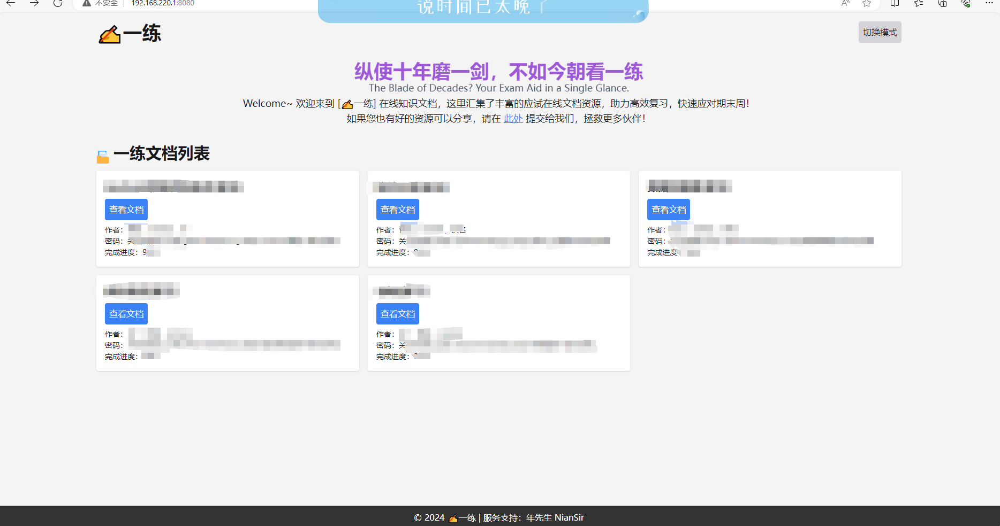
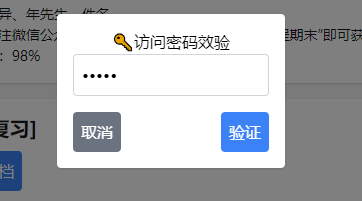
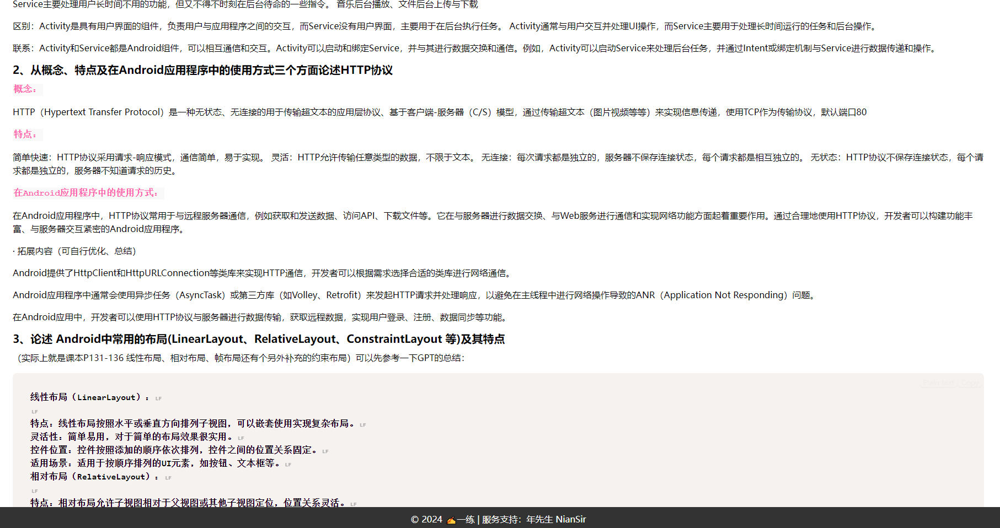

# ✍一练文档 - 只做有质量的学习分享

👏从现在起，使用纯前端发布你的知识文档！

🎉您可以直接使用免费的GitHub Pages服务搭建，无需服务器和复杂的维护

项目创建的初衷就是简单分享Markdown知识文档，本项目采用纯前端实现，开箱即用，无需复杂配置，如果感觉本项目不错，欢迎点个⭐~

**功能特色：**

- [x] 📜支持Markdown网页在线解析预览
- [x] 🌏主题样式使用TailwindCSS生成，代码简单结构整洁，无加密内容
- [x] 📝文档信息一一对应，可以为每个文档设置不同的访问密钥
- [x] 💡配置文件使用JSON存储设置，便于控制和二次开发
- [x] 🛡内容保护，即便用户分享预览点击进入仍然需要重新身份校验
- [x] 🎉开源！在遵循GPLv3协议的前提下，鼓励共同协作和二次开发

**界面展示：**

首页：

验证页：

在线预览页：

**交流/联系：**

QQ频道号：n01nzhtu9a（程序猿森林）

微信：NianSir6

**赞助：**

创作不易，如果您觉得这个项目给您带来的帮助，不妨支持一下吧~

微信：

