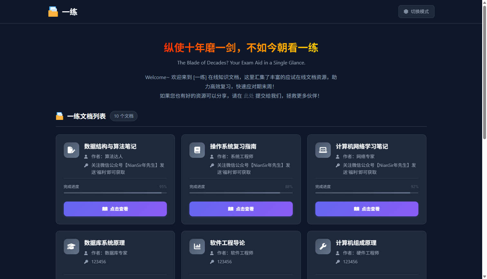
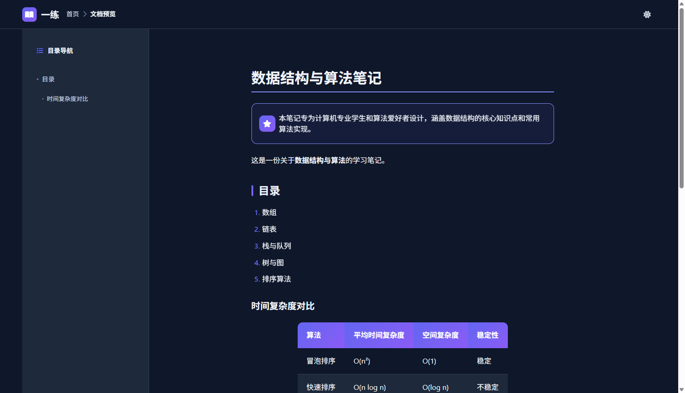

# ✍ 一练文档 - OneGlance
<p align="center">


</p>

👏 从现在起，使用纯前端发布你的知识文档！

🎉 您可以直接使用免费的 GitHub Pages 服务搭建，无需服务器和复杂的维护

项目创建的初衷就是简单分享 Markdown 知识文档，本项目采用纯前端实现，开箱即用，无需复杂配置，如果感觉本项目不错，欢迎点个⭐~

## ✨ 功能特色

- [x] 📜 支持 Markdown 网页在线解析预览
- [x] 🌏 现代深色主题设计，使用 Font Awesome 图标库
- [x] 📝 文档信息一一对应，可以为每个文档设置不同的访问密钥
- [x] 💡 配置文件使用 JSON 存储设置，便于控制和二次开发
- [x] 🛡 内容保护，即便用户分享预览点击进入仍然需要重新身份校验
- [x] 📚 左侧固定目录导航，滚动时高亮当前章节
- [x] 🎨 自定义提示框样式（重要提示、小贴士、警告）
- [x] 📱 响应式设计，支持移动端访问
- [x] 🎉 开源！在遵循 GPLv3 协议的前提下，鼓励共同协作和二次开发

## 🖼️ 界面展示

### 首页


### 文档预览页


## 📁 项目结构

```
OneGlance/
├── index.html          # 首页（文档列表）
├── viewBox.html        # 文档详情预览页
├── mymd/
│   ├── config.json     # 文档配置文件
│   ├── template.md     # 文档模板
│   └── *.md            # 各文档内容
├── image/              # 截图资源
└── DOC_GUIDE.md        # 文档编写规范
```

## 🚀 快速开始

### 本地运行
```bash
# 进入项目目录
cd OneGlance

# 启动本地服务器（推荐使用 Python 或 http-server）
python -m http.server 8080
# 或
npx http-server -p 8080
```

### GitHub Pages 部署
1. Fork 本仓库
2. 在仓库设置中开启 GitHub Pages
3. 选择 `main` 分支作为源
4. 访问 `https://username.github.io/OneGlance`

## 🔧 配置说明

在 `mymd/config.json` 中添加文档配置：

```json
{
    "title": "文档标题",
    "path": "mymd/document.md",
    "password": "访问密码",
    "description": "文档描述"
}
```

## 📝 文档编写规范

请参考 [DOC_GUIDE.md](./DOC_GUIDE.md) 和 [template.md](./mymd/template.md)

## 💬 交流/联系

- QQ 频道号：n01nzhtu9a（程序猿森林）
- 微信：NianSir6

## 🤝 贡献

欢迎提交 Issue 和 Pull Request！

## 📄 许可证

本项目采用 GPLv3 开源协议，详见 [LICENSE](./LICENSE)

## 💰 赞助

创作不易，如果您觉得这个项目给您带来的帮助，不妨支持一下吧~

微信：
